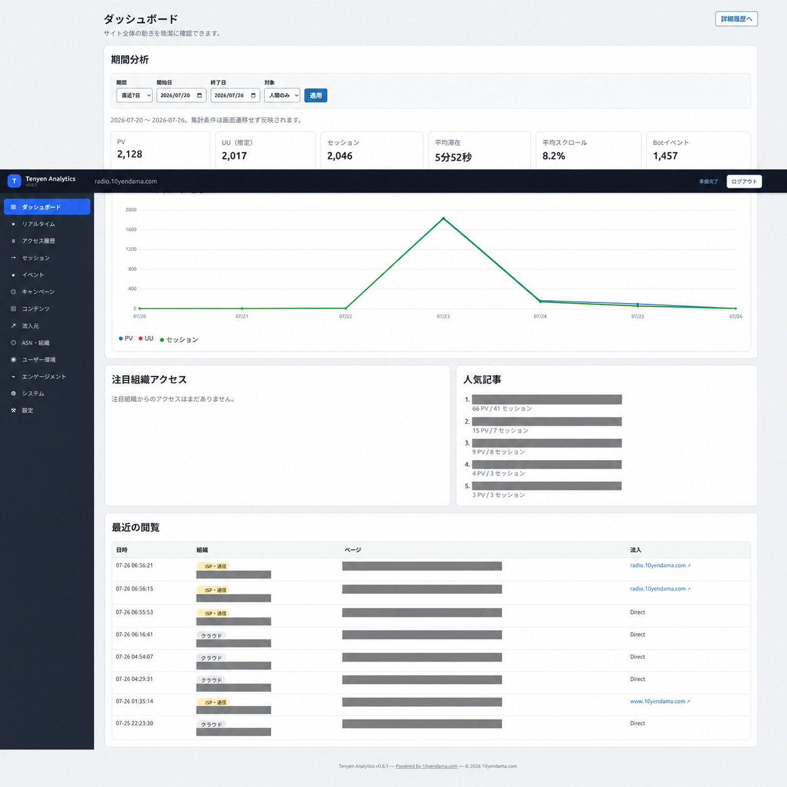

[English](README.md)

# Tenyen Analytics

Tenyen Analyticsは、ブラウザ上のインストーラー、ページビュー・エンゲージメント計測、GeoLite2位置情報、ASN分析、Bot判定、非同期管理コンソールを備えたPHPサイト向けのセルフホスト型アクセス解析プラットフォームです。

## 概要

管理者自身の環境に解析データを保存します。CDN、外部解析サービス、本番用の必須ビルド工程はありません。

## 機能

- ページビュー、エンゲージメント、リンク、ダウンロード、404、制限付きカスタムイベントの計測
- 流入チャネル、参照元ドメイン、初回接触UTMキャンペーン帰属
- 生IPの暗号化保存とHMACによる完全一致検索
- 内蔵MMDB ReaderによるGeoLite2 City・ASN情報の付加
- Bot判定、組織分類、10種類の非同期管理画面
- 英語・標準日本語のインターフェース

## 動作要件

PHP 8.1以降、PDO MySQL、MySQLまたはMariaDBが必要です。公開本番環境ではHTTPSが必須です。HTTPはローカル・テスト環境で利用できます。

## SSH・Composerなしの簡単インストール

安定版ZIPをアップロードし、`data/`と`storage/`をPHPから書き込み可能にし、DocumentRootを`public/`に設定して`/install/`を開きます。Composerは任意です。

## 共有サーバーへのインストール

DocumentRootを変更できない場合は`analytics/`以下へ配置し、`/analytics/public/install/`を開きます。`public/`以外は外部公開しないでください。

## 推奨DocumentRoot構成

Webから公開するディレクトリは`public/`だけです。可能な場合、`app/`、`config.php`、`data/`、`storage/`、CLIツールはDocumentRootの外へ置いてください。

## GUIインストーラー

7段階のウィザードで環境確認、サイト・DB設定、管理者作成、任意のGeoLite2設定を行います。秘密情報は`config.php`へ保存され、完了時に`storage/installed.lock`を作成します。

## GeoLite2の設定

GeoLite2 MMDBは同梱していません。MaxMindの利用条件に従って取得してください。GUIは512 KB単位で分割送信し、DB種類を検証します。公式`maxmind-db/reader`がない場合は内蔵Readerを使用します。ASN組織名はMaxMind提供値を変更せず表示します。

## 管理コンソール

インストーラーで作成したアカウントでログインします。イベント、キャンペーン、流入元、セッション、既存分析画面を認証・CSRF保護された非同期通信で表示します。

## イベント・キャンペーン連携

外部リンクとダウンロードは自動計測します。内部リンクは`track_internal_links`、ボタンは`track_buttons`と`data-tenyen-event="name"`、フォームは`track_forms`と同属性を明示した場合だけ計測します。フォーム値、DOM、パスワード、決済情報は収集しません。

`TYAnalytics.trackEvent('radio_play', {station: 'example-station', server: 'primary'})`または`TYAnalytics.trackEvent('stream_server_change', {server: 'backup'})`を利用できます。名前とスカラー型メタデータには厳格な上限があります。ラジオを自動連携する機能ではありません。

Webサーバーに依存しない404テンプレートでは`TYAnalytics.trackNotFound(location.href)`を呼び出します。通常ページビューとの重複を避ける場合、そのテンプレートでは通常埋め込みを外してください。

チャネルはDirect、Organic Search、Social、Referral、Internal、Campaign、Unknownです。認識する5種類のUTMは参照元分類より優先され、キャンペーン画面は入口ページを初回接触として扱います。

## CLIツール

診断は`php bin/doctor.php`、保持期間の整理は`php bin/cleanup.php`、認証情報生成は`php bin/generate-secrets.php`、CLI案内は`php bin/install.php`を実行します。

## 以前のバージョンからの更新

バックアップ後、`config.php`、`data/`、`storage/`を保持してアプリケーションファイルを上書きします。0.6.1は帰属・イベント列と3索引を冪等に追加します。v0.6.0の設定、導入ロック、認証情報、トークン、鍵、MMDB、履歴イベントを保持します。

直帰率は1ページだけ閲覧した入口セッション数÷入口セッション数です。クリック率は対象ページから一致するクリックがあったセッション数÷そのページの対象ページビューを含むセッション数で、分母0は0%です。通知、保持管理、エクスポート、日次集計、複数サイト、権限、完全な除外管理は今後の課題です。

## プライバシーとセキュリティ

IP、アクセス履歴、参照元、User-Agent・端末情報、地域・ASN情報を処理する場合があります。運営者は保持期間とセルフホスト処理をプライバシーポリシーに記載し、設定、ログ、バックアップ、解析データへのアクセスを制限してください。

## トラブルシューティング

PHP 8.1以降、PDO MySQL、ディレクトリ権限、DB認証情報、公開URL、HTTPSを確認してください。GeoLite2がなくても収集は動作します。

## 開発

`php tests/run.php`、PHP lint、JavaScript構文確認、`tools/build-release.sh`を実行してください。本番動作にComposerやNodeを必須としないでください。

## ライセンス

Copyright © 2026 10yendama.com. GPL-2.0-or-laterです。[LICENSE](LICENSE)と[THIRD-PARTY-NOTICES.md](THIRD-PARTY-NOTICES.md)を参照してください。
